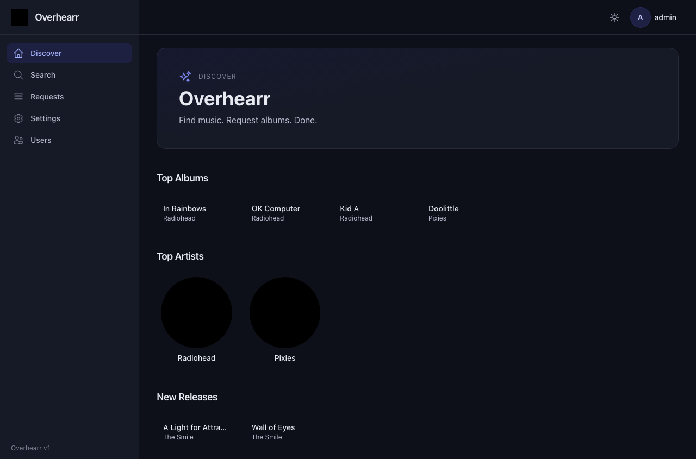

# Overhearr

A self-hosted music request manager for [Lidarr](https://lidarr.audio/), in
the spirit of [Overseerr](https://overseerr.dev/). Browse what's hot on
Last.fm, search MusicBrainz, and one-click an album or whole discography
into your Lidarr library.



## Quick start (Docker)

```sh
# 1. Generate secrets (write them down).
docker run --rm alpine sh -c "apk add --quiet openssl && \
  echo SESSION_SECRET=\$(openssl rand -hex 32) && \
  echo ENCRYPTION_KEY=\$(openssl rand -hex 32)"

# 2. Run.
docker run -d --name overhearr \
  -p 5056:5056 \
  -v /srv/overhearr/config:/config \
  -e SESSION_SECRET=<from step 1> \
  -e ENCRYPTION_KEY=<from step 1> \
  --restart unless-stopped \
  ghcr.io/dcurlewis/overhearr:latest
```

Browse to `http://<host>:5056` and follow the first-run wizard:

1. Create an admin account.
2. Point Overhearr at your Lidarr (URL + API key) and pick a quality
   profile + root folder.
3. Optionally add a Last.fm API key to populate the Discover page.

That's it. Everything else lives in the in-app **Settings** page.

### docker-compose

```sh
cp .env.docker.example .env.docker
./scripts/generate-secrets.sh >> .env.docker      # appends the two hex secrets
docker compose --env-file .env.docker up -d
```

## Deploying to Unraid

A Community Apps template lives at [`unraid/overhearr.xml`](unraid/overhearr.xml).

1. **Get the image onto Unraid.** Pull from GHCR:
   
   ```sh
   docker pull ghcr.io/dcurlewis/overhearr:latest
   ```
   
   Or copy a local build over:
   
   ```sh
   docker save ghcr.io/dcurlewis/overhearr:latest | ssh root@unraid 'docker load'
   ```

2. **Install the template.** Either:
   
   - In the Unraid UI: *Apps → Add Container → Template repositories*
     and add the raw URL of `unraid/overhearr.xml` in your fork; or
   - Drop the file into `/boot/config/plugins/dockerMan/templates-user/`
     so it shows up under *Docker → Add Container → Select a template →
     User templates → Overhearr*.

3. **Generate the secrets** (one each, never reused):
   
   ```sh
   ./scripts/generate-secrets.sh
   # or, if you don't have the repo on the host:
   openssl rand -hex 32     # SESSION_SECRET
   openssl rand -hex 32     # ENCRYPTION_KEY
   ```
   
   Paste them into the masked **Session secret** / **Encryption key**
   fields in the Unraid template form.

4. **Fix bind-mount permissions.** The container always runs as uid 1000.
   Before first start, on the Unraid box:
   
   ```sh
   mkdir -p /mnt/user/appdata/overhearr
   chown -R 1000:1000 /mnt/user/appdata/overhearr
   ```

5. **Start the container** and visit `http://<unraid-ip>:5056`. The
   first-run wizard creates the admin account, accepts your Lidarr URL +
   API key, lets you pick a quality + metadata profile and root folder,
   and persists everything to `/config/db/overhearr.db`.

6. **(Optional) Reverse proxy.** If you're fronting Overhearr with SWAG /
   nginx / Traefik / Cloudflare, set `TRUST_PROXY=true` in the template
   so secure cookies and client IPs work correctly. Overhearr does not
   currently use websockets — only standard HTTP — so no `Upgrade`
   header dance is required, but it's still good practice to forward
   them in case a future version (e.g. live request status) adopts SSE
   or WS.

## Updating

```sh
docker pull ghcr.io/dcurlewis/overhearr:latest
docker stop overhearr
docker rm overhearr                       # then re-create with same -v / -e
docker run ...                            # same args as before
```

Database migrations run automatically on every container start (`prisma
migrate deploy` in the entrypoint), so there is no manual step. Existing
data in `/config` is preserved.

## Backup

Everything stateful lives under `/config`:

| Path                      | What it is                                             |
| ------------------------- | ------------------------------------------------------ |
| `/config/db/overhearr.db` | SQLite database (users, settings, requests, sessions). |

Backing up the `/config` directory while the container is stopped (or via
`sqlite3 .backup`) gives you a full point-in-time snapshot. Nothing else
is state-bearing — the in-memory MusicBrainz / Last.fm cache is
disposable.

## Configuration

All Lidarr / Last.fm config is stored encrypted in the SQLite DB and
managed via the UI. Only infrastructure values come from environment
variables:

| Variable         | Required | Default                        | Notes                                                                                        |
| ---------------- | -------- | ------------------------------ | -------------------------------------------------------------------------------------------- |
| `SESSION_SECRET` | yes      | —                              | 64 hex chars. Signs the session cookie.                                                      |
| `ENCRYPTION_KEY` | yes      | —                              | 64 hex chars (32 bytes). Encrypts API keys at rest. Rotating invalidates stored credentials. |
| `PORT`           | no       | `5056`                         | HTTP listen port.                                                                            |
| `HOST`           | no       | `0.0.0.0`                      | Bind address.                                                                                |
| `LOG_LEVEL`      | no       | `info`                         | `fatal` \| `error` \| `warn` \| `info` \| `debug` \| `trace`.                                |
| `DATABASE_URL`   | no       | `file:/config/db/overhearr.db` | SQLite path. Override only if you really know why.                                           |
| `TRUST_PROXY`    | no       | `false`                        | Set `true` behind nginx / Traefik / Cloudflare so secure cookies + IPs work.                 |

### Volumes

| Path      | Contents                                              |
| --------- | ----------------------------------------------------- |
| `/config` | SQLite DB (`db/overhearr.db`) and future cache files. |

The container runs as uid/gid `1000:1000` (the standard `node` user from
the `node:20-alpine` image). Make sure the host directory you bind to
`/config` is writable by that uid — `chown 1000:1000 /srv/overhearr/config`
on Unraid / a typical Linux host.

## Building from source

Requires Node.js 20+.

```sh
git clone https://github.com/dcurlewis/overhearr.git
cd overhearr
npm ci
cp .env.example .env                # fill in SESSION_SECRET / ENCRYPTION_KEY
npm run db:migrate                  # apply migrations to local sqlite
npm run dev                         # tsx watch on port 5056
```

Useful scripts:

| Command             | What it does                              |
| ------------------- | ----------------------------------------- |
| `npm run build`     | `next build` + tsc compile of the server. |
| `npm start`         | Run the built server.                     |
| `npm run lint`      | ESLint over `server/` and `src/`.         |
| `npm run typecheck` | `tsc --noEmit` across the workspace.      |
| `npm test`          | Vitest unit + integration suite.          |
| `npm run test:e2e`  | Playwright E2E (boots the real server).   |

To build the production image locally:

```sh
docker build -t ghcr.io/dcurlewis/overhearr:latest .
```

## Architecture

Overhearr is a hybrid Next.js + Express app. Express owns the runtime
and mounts the API under `/api/*`; everything else falls through to a
Next.js handler that renders the React UI. This keeps the request
pipeline single-process (one port, one container, shared session
middleware) while letting us write SSR pages with the Next.js App
Router.

State lives in a single SQLite database via Prisma. Sessions are
persisted in the same DB so the container is fully stateless across
restarts. Lidarr and Last.fm API keys are encrypted with AES-256-GCM
using `ENCRYPTION_KEY` before being written.

A background reconciliation worker polls Lidarr periodically and
updates the status (`PENDING` → `PROCESSING` → `AVAILABLE` / `FAILED`)
of outstanding requests. There is no separate queue / Redis dependency.

## License

MIT.
